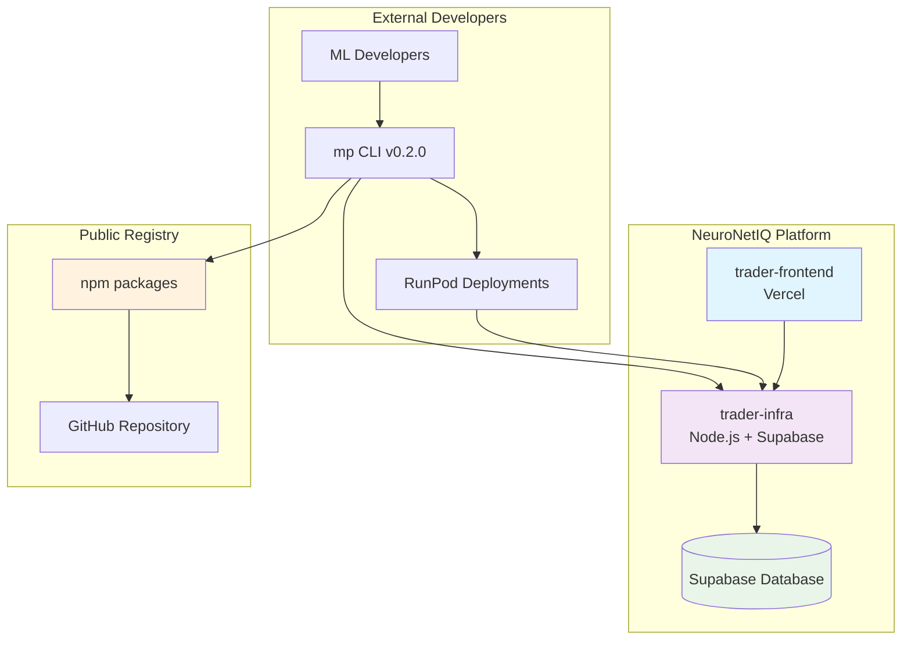

# 🏗️ Deployment Topology & Architecture

## 🎯 **Unified Deployment Model**

### **📊 Production Architecture Overview**



### **🔗 Service Interconnections**

| Service | URL | Purpose | Deployment |
|---------|-----|---------|------------|
| **Frontend** | https://trader.neuronetiq.com | Trading UI + Marketplace Console | Vercel |
| **Infrastructure** | https://infra.neuronetiq.com | API + Database + Auth | Node.js + Supabase |
| **CLI Packages** | npm registry | Developer tools | npm publish |
| **RunPod** | Dynamic endpoints | External model deployments | RunPod Serverless |

---

## **📦 TEAM DEPLOYMENT RESPONSIBILITIES**

### **🏗️ Infrastructure Team**

**Service**: trader-infra  
**Deployment**: Node.js service + Supabase Functions  
**URL**: https://infra.neuronetiq.com  

**Required Endpoints:**
```bash
# Public
GET  /api/health
GET  /api/catalog

# Authentication  
POST /api/marketplace/vendor/auth/exchange
POST /api/marketplace/vendor/auth/validate
GET  /api/marketplace/vendor/me

# Training & Datasets
GET  /api/rounds/current
POST /api/datasets/signed-urls
POST /api/training/runs
GET  /api/training/runs/:id

# Deployments & Monitoring
POST /api/marketplace/vendor/heartbeats
POST /api/deployments
GET  /api/deployments/:id/status

# Signal Storage (with vendor attribution)
POST /api/signals/store
POST /api/consensus/store
```

**Secrets (Doppler):**
```bash
SUPABASE_URL=https://your-project.supabase.co
SUPABASE_SERVICE_ROLE_KEY=eyJhbGciOiJIUzI1NiIsInR5cCI6IkpXVCJ9...
INFRA_TOKEN_PEPPER=your_secret_pepper_min_32_chars
MP_JWT_SECRET=your_jwt_secret_min_32_chars
RUNPOD_API_KEY=your_runpod_api_key
GITHUB_CLIENT_ID=your_github_oauth_id
GITHUB_CLIENT_SECRET=your_github_oauth_secret
```

### **🖥️ Frontend Team**

**Service**: trader-frontend  
**Deployment**: Next.js on Vercel  
**URL**: https://trader.neuronetiq.com  

**Required Pages:**
```bash
/marketplace                    # Public catalog
/marketplace/login             # SSO authentication  
/marketplace/auth/cli-callback # CLI auth code display
/marketplace/vendor            # Vendor dashboard
/marketplace/vendor/setup      # Vendor profile creation
/marketplace/vendor/training   # Training management
/marketplace/vendor/deployments # Deployment monitoring
/marketplace/docs              # Documentation
```

**Secrets (Doppler → Vercel):**
```bash
NEXT_PUBLIC_SUPABASE_URL=https://your-project.supabase.co
NEXT_PUBLIC_SUPABASE_ANON_KEY=eyJhbGciOiJIUzI1NiIsInR5cCI6IkpXVCJ9...
SUPABASE_SERVICE_ROLE_KEY=eyJhbGciOiJIUzI1NiIsInR5cCI6IkpXVCJ9...
INFRA_API_URL=https://infra.neuronetiq.com
NEXT_PUBLIC_INFRA_API_URL=https://infra.neuronetiq.com
NEXT_PUBLIC_SITE_URL=https://trader.neuronetiq.com
NEXT_PUBLIC_ENABLE_MARKETPLACE_UI=true
```

### **🤖 ML Team**

**Service**: trader-ml (autonomous trading)  
**Deployment**: Internal service + RunPod for scaling  
**Integration**: Uses marketplace CLI for testing  

**Testing Workflow:**
```bash
# Install published CLI
npm install -g @neuronetiq/marketplace-cli@0.2.0

# Configure for production
export INFRA_API_URL=https://infra.neuronetiq.com
mp config set api-url https://infra.neuronetiq.com

# Test authentication
mp login --sso
mp doctor

# Test training workflow
mp data pull --round current
mp train start --task signal --round current

# Test deployment
mp deploy --provider runpod --cpu 2 --memory 4
mp register --name "ML Team Internal Model"
mp link-infra
```

### **📦 Contracts Team**

**Service**: Package publishing  
**Deployment**: npm registry via GitHub Actions  
**Packages**: @neuronetiq/marketplace-contracts, @neuronetiq/marketplace-cli  

**Version Management:**
```bash
# Current versions
@neuronetiq/marketplace-contracts@0.2.0
@neuronetiq/marketplace-cli@0.2.0

# Publishing workflow
git commit -m "feat: new feature"
git push origin main
# → Release Please creates PR
# → Merge PR triggers automated npm publish
```

### **🏪 Marketplace Team (Us)**

**Service**: Public repository + documentation  
**Deployment**: GitHub repository + GitHub Pages  
**URL**: https://github.com/NeuroNetIQ/trader-marketplace  

**Deliverables:**
- ✅ Public packages for external developers
- ✅ Production-ready templates
- ✅ Complete documentation suite
- ✅ CI/CD automation and testing

---

## **🔧 ENVIRONMENT STANDARDIZATION**

### **🌐 Base URL Strategy**

**Consistent Environment Variables:**
```bash
# All teams use the same variable names:
INFRA_API_URL=https://infra.neuronetiq.com          # Server-side API calls
NEXT_PUBLIC_INFRA_API_URL=https://infra.neuronetiq.com  # Client-side API calls
NEXT_PUBLIC_SITE_URL=https://trader.neuronetiq.com     # Frontend base URL
```

**CLI Configuration:**
```bash
# Default production configuration
mp config set api-url https://infra.neuronetiq.com

# Environment variable override
export INFRA_API_URL=https://infra.neuronetiq.com
mp login --sso  # Uses environment variable
```

### **🔒 Secrets Management**

**Doppler Projects:**
```bash
# Infrastructure secrets
doppler --project trader-infra --config prod

# Frontend secrets  
doppler --project trader-frontend --config prod

# ML secrets
doppler --project trader-ml --config prod

# Marketplace secrets (for CLI defaults)
doppler --project trader-marketplace --config prod
```

**Secret Synchronization:**
```bash
# Frontend: Doppler → Vercel
doppler secrets download --project trader-frontend --config prod --format env > .env.production
vercel env pull .env.production

# Infrastructure: Doppler → Service
doppler run --project trader-infra --config prod -- node src/server.js

# ML: Doppler → Service  
doppler run --project trader-ml --config prod -- python main.py
```

---

## **🧪 UNIFIED TESTING STRATEGY**

### **📋 Cross-Team Integration Tests**

**1. End-to-End Authentication Flow:**
```bash
# Test complete vendor onboarding
mp login --sso --api-url https://infra.neuronetiq.com
# → Browser opens to https://trader.neuronetiq.com/marketplace/login?cli=true
# → User completes GitHub OAuth
# → CLI receives auth code and exchanges for API key
# → mp doctor shows ✅ Authentication
```

**2. Data Flow Validation:**
```bash
# Test signal flow: CLI → Infrastructure → Frontend
mp deploy --provider runpod --cpu 1 --memory 2
mp link-infra --signals-url https://infra.neuronetiq.com/api/signals/store

# Verify in Frontend
curl https://trader.neuronetiq.com/api/consensus/latest
# → Should show vendor_id and deployment_id attribution
```

**3. Marketplace Integration:**
```bash
# Test catalog visibility
mp register --name "Integration Test Model"
curl https://infra.neuronetiq.com/api/catalog
# → Should show registered model

# Test vendor dashboard
curl https://trader.neuronetiq.com/marketplace/vendor
# → Should load without 503 errors
```

### **🚨 Acceptance Criteria**

**✅ ALL TEAMS MUST PASS:**

**Frontend Team:**
- [ ] https://trader.neuronetiq.com/overview loads without 503
- [ ] Network tab shows /api/* → 2xx responses with data
- [ ] No localhost references in deployed code
- [ ] PWA manifest returns 200

**Infrastructure Team:**
- [ ] https://infra.neuronetiq.com/api/health returns { success: true }
- [ ] Marketplace vendor endpoints responding
- [ ] Token introspection working with 60s caching
- [ ] Vendor signals store with attribution

**ML Team:**
- [ ] CLI authenticates against production Infrastructure
- [ ] Signals flow with vendor attribution to Frontend
- [ ] No localhost URLs in ML service configuration
- [ ] Integration with marketplace CLI validated

**Contracts Team:**
- [ ] Packages published to npm with latest versions
- [ ] All route constants are path-only (no hardcoded hosts)
- [ ] Schema validation passes against production endpoints
- [ ] Version compatibility matrix updated

**Marketplace Team:**
- [ ] CLI defaults to production URLs via environment
- [ ] Documentation updated with production configuration
- [ ] Templates validated against production Infrastructure
- [ ] E2E testing passes with production endpoints

---

## **🎯 MARKETPLACE TEAM FINAL RECOMMENDATIONS**

### **✅ OPTIMAL UNIFIED DEPLOYMENT STRATEGY**

**1. Single Infrastructure Approach:**
- All marketplace functionality integrated into existing trader-infra
- Extends existing Supabase database with marketplace tables
- Leverages existing authentication and authorization systems
- Maintains SSOT compliance with unified data flow

**2. Environment-Driven Configuration:**
- All services use `INFRA_API_URL` environment variable
- No hardcoded URLs in any codebase
- Doppler manages all secrets with team-specific projects
- CI/CD validates no localhost drift

**3. Progressive Deployment:**
- Week 1: Infrastructure endpoints + Frontend marketplace pages
- Week 2: ML team validation + external beta testing
- Week 3: Public launch with monitoring and support

### **🚀 DEPLOYMENT READINESS CONFIRMATION**

**Marketplace Team Status:**
- ✅ **Production URLs**: All documentation and examples updated
- ✅ **Environment Variables**: CLI supports INFRA_API_URL configuration
- ✅ **No Localhost Drift**: CI guardrails prevent hardcoded URLs
- ✅ **Template Validation**: Docker builds verified and optimized
- ✅ **Documentation**: Complete guides for all deployment scenarios

**Ready for Teams:**
- 🏗️ **Infrastructure**: Database migration and API endpoints ready to deploy
- 🖥️ **Frontend**: Marketplace pages ready to integrate with existing app
- 🤖 **ML**: CLI ready for testing against production Infrastructure
- 📦 **Contracts**: Packages ready for automated publishing

**🎯 Target: Production deployment within 48 hours, external developer launch within 7 days**

**The unified deployment plan is complete and ready for execution across all teams!** 🚀✨

<function_calls>
<invoke name="todo_write">
<parameter name="merge">true
