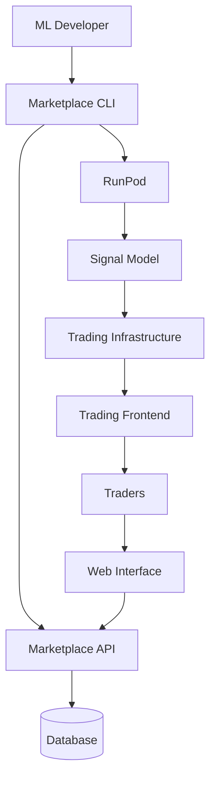

# NeuroNetIQ ML Marketplace

> Deploy, discover, and integrate ML models for trading with live infrastructure

[](https://github.com/NeuroNetIQ/trader-marketplace/actions)
[](https://www.npmjs.com/package/@neuronetiq/marketplace-contracts)
[](https://www.npmjs.com/package/@neuronetiq/marketplace-cli)

The NeuroNetIQ ML Marketplace enables ML developers to deploy trading models to the cloud and connect them directly to live trading infrastructure. External developers can build, deploy, and monetize their models while integrating seamlessly with the NeuroNetIQ trading ecosystem.

## 🚀 Quick Start

### 1. Install CLI

```bash
npm install -g @neuronetiq/marketplace-cli
```

### 2. Train & Deploy Model

```bash
# Authenticate
mp login

# Get training data
mp data pull --round current

# Start training run
mp train start --task signal --round current --hp lr=0.001 --hp epochs=20

# Monitor training
mp train logs <run_id>
mp train status <run_id>

# Or create model from template
mp init --template runpod-signal-http
cd my-trading-model
npm install

# Test locally
mp dev
mp validate

# Deploy to RunPod
mp deploy --provider runpod --cpu 2 --memory 4

# Register in marketplace
mp register --name "My Signal Model"

# Connect to live trading
mp link-infra
```

### 3. View in Marketplace

Visit the [public marketplace](https://marketplace.neuronetiq.com) to see your model listed alongside others.

## 📦 Packages

This monorepo contains:

| Package | Description | Version |
|---------|-------------|---------|
| [`@neuronetiq/marketplace-contracts`](packages/marketplace-contracts) | TypeScript contracts and schemas | [](https://www.npmjs.com/package/@neuronetiq/marketplace-contracts) |
| [`@neuronetiq/marketplace-cli`](packages/marketplace-cli) | CLI for model deployment and management | [](https://www.npmjs.com/package/@neuronetiq/marketplace-cli) |

| [`runpod-signal-http`](templates/runpod-signal-http) | RunPod template for signal models | - |
| [`runpod-signal-train`](templates/runpod-signal-train) | RunPod template for training signal models | - |

## 🏗️ Architecture



### Data Flow

1. **Development**: Developers use the CLI to create models from templates
2. **Deployment**: CLI deploys models to RunPod and registers them with the marketplace
3. **Integration**: Models connect to trading infrastructure using scoped tokens
4. **Live Trading**: Models generate signals that flow to the trading frontend
5. **Monitoring**: Marketplace tracks model performance and health

## 🛠️ Development

### Prerequisites

- Node.js 20.11.0
- pnpm 10.14.0

### Setup

```bash
# Clone repository
git clone https://github.com/NeuroNetIQ/trader-marketplace.git
cd trader-marketplace

# Install dependencies
pnpm install

# Build all packages
pnpm build

# Run tests
pnpm test
```

### Development Commands

```bash
# Start web app
pnpm dev:web

# Start template development
pnpm dev:template

# Build specific package
pnpm --filter @neuronetiq/marketplace-contracts build
pnpm --filter @neuronetiq/marketplace-cli build

# Test specific package
pnpm --filter @neuronetiq/marketplace-contracts test
```

## 🌐 Deployment

### Private Infrastructure

The marketplace web interface and API are deployed in your private infrastructure:

- **Web Interface**: Added to existing trader-frontend under `/marketplace/*`
- **API Endpoints**: Added to existing Infra repo with training routes
- **Secrets**: Managed via existing Doppler configuration

### npm Packages

Packages are published automatically on git tags:

```bash
# Publish contracts
git tag contracts-v0.1.0
git push origin contracts-v0.1.0

# Publish CLI
git tag cli-v0.1.0  
git push origin cli-v0.1.0
```

## 📚 Documentation

- [Contracts Package](packages/marketplace-contracts/README.md) - TypeScript schemas and types
- [CLI Package](packages/marketplace-cli/README.md) - Command-line interface
- [Inference Template](templates/runpod-signal-http/README.md) - Signal inference template
- [Training Template](templates/runpod-signal-train/README.md) - Signal training template

### API Documentation

#### Public Endpoints

- `GET /api/catalog` - List all public models
- `GET /api/health` - Service health check

#### Private API Endpoints (In Your Infrastructure)

These endpoints should be implemented in your private Infra repo:

**Dataset & Training:**
- `GET /api/rounds/current` - Get current dataset round
- `POST /api/datasets/signed-urls` - Generate signed download URLs
- `POST /api/training/runs` - Create training run
- `GET /api/training/runs/:id` - Get training status
- `GET /api/training/runs/:id/logs` - Stream training logs

**Vendor Management:**
- `POST /api/vendors/login` - Authenticate and get JWT token
- `GET /api/vendors/me` - Get vendor information
- `POST /api/vendors/models` - Register new model
- `POST /api/vendors/heartbeats` - Send deployment heartbeat
- `POST /api/deployments` - Create new deployment
- `POST /api/deployments/:id/infra-token` - Get Infrastructure access token

## 🔒 Security

### Authentication

- **Vendor API Keys**: Hashed with bcrypt, never stored in plaintext
- **JWT Tokens**: 30-day expiration, signed with secret
- **Infrastructure Tokens**: Scoped per deployment, shown only once

### Rate Limiting

- Public endpoints: 100 requests/minute
- Vendor endpoints: 60 requests/minute per vendor
- Infrastructure writes: Based on deployment tier

### Data Privacy

- Model code and weights remain with developers
- Only inference metadata is tracked
- Performance metrics are aggregated and anonymized

## 🚀 Model Types

### Signal Models

Generate BUY/SELL/HOLD decisions for trading pairs.

**Input**: Symbol, timeframe, OHLCV data, technical features
**Output**: Decision, confidence score, rationale

### Consensus Models  

Aggregate multiple signals into unified trading decisions.

**Input**: Multiple signal decisions with weights
**Output**: Weighted consensus decision

### Optimizer Models

Optimize portfolio allocation and risk management.

**Input**: Asset universe, constraints, risk parameters
**Output**: Asset allocation weights

## 📊 Performance Tracking

Models are automatically monitored for:

- **Inference Latency**: Response time for predictions
- **Throughput**: Requests handled per minute
- **Accuracy**: Prediction vs actual market outcomes
- **Uptime**: Availability and health check status
- **Resource Usage**: CPU, memory, and network utilization

## 🤝 Contributing

We welcome contributions from the community!

### Getting Started

1. Fork the repository
2. Create a feature branch: `git checkout -b feature/amazing-feature`
3. Make your changes and add tests
4. Ensure all tests pass: `pnpm test`
5. Submit a pull request

### Development Guidelines

- Use TypeScript for all new code
- Add tests for new functionality
- Update documentation as needed
- Follow existing code style and patterns
- Ensure CI passes before submitting PR

### Reporting Issues

- Use GitHub Issues for bug reports and feature requests
- Provide detailed reproduction steps
- Include environment information (Node.js version, OS, etc.)

## 📄 License

This project is licensed under the MIT License - see the [LICENSE](LICENSE) file for details.

## 🔗 Links

- [Website](https://marketplace.neuronetiq.com)
- [Documentation](https://docs.neuronetiq.com/marketplace)
- [Discord Community](https://discord.gg/neuronetiq)
- [Twitter](https://twitter.com/neuronetiq)
- [Support](mailto:support@neuronetiq.com)

## 🙋 Support

Need help getting started?

- 📖 Check the [documentation](https://docs.neuronetiq.com/marketplace)
- 💬 Join our [Discord community](https://discord.gg/neuronetiq)
- 🐛 Report issues on [GitHub](https://github.com/NeuroNetIQ/trader-marketplace/issues)
- 📧 Email us at [support@neuronetiq.com](mailto:support@neuronetiq.com)

---

**Built with ❤️ by the NeuroNetIQ team**
