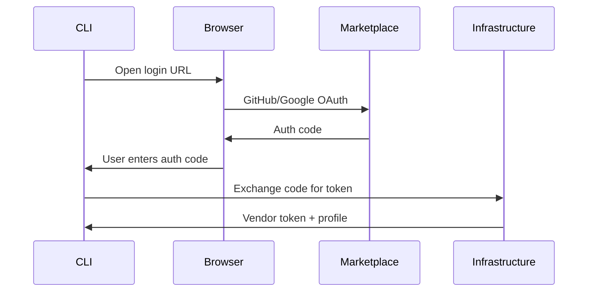
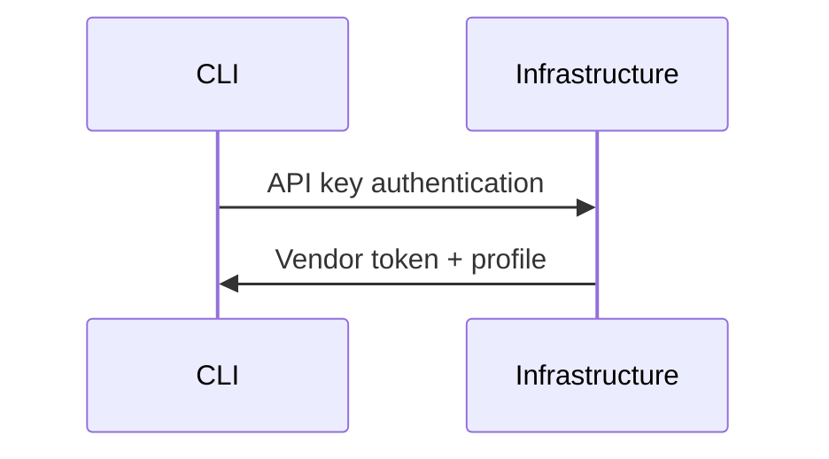

# 🔐 Authentication Guide

## SSO vs API Key - When to Use Which?

### **SSO (Single Sign-On) - Recommended**

**Best for:**
- ✅ Initial setup and onboarding
- ✅ Interactive development
- ✅ Vendor console access
- ✅ One-time model registration

**How it works:**
```bash
mp login --sso
# → Opens browser to marketplace login
# → GitHub/Google OAuth flow
# → Returns to CLI with auth code
# → CLI exchanges code for vendor token
```

**Benefits:**
- Secure: No long-lived credentials on disk
- Convenient: Same login as web interface
- Integrated: Works with vendor console

### **API Key - For Automation**

**Best for:**
- ✅ CI/CD pipelines
- ✅ Automated deployments
- ✅ Headless environments
- ✅ Production monitoring

**How it works:**
```bash
mp login --api-key vk_your_api_key
# → Direct authentication
# → Stores encrypted token locally
```

**Benefits:**
- Automation-friendly: No browser required
- Scriptable: Works in CI/CD
- Persistent: Long-lived credentials

## Authentication Flow Details

### **SSO Flow (Browser-based)**



### **API Key Flow (Direct)**



## Token Storage & Security

### **Local Storage**

CLI stores credentials in `~/.mp/config.json` with 0600 permissions:

```json
{
  "apiKey": "encrypted_vendor_token",
  "apiUrl": "https://infra.neuronetiq.com",
  "vendorId": "vendor_abc123",
  "infraUrl": "https://infra.neuronetiq.com",
  "infraToken": "sit_scoped_infra_token"
}
```

### **Security Features**

- ✅ **Encryption**: All tokens encrypted at rest
- ✅ **Expiration**: Tokens auto-expire (30 days)
- ✅ **Rotation**: `mp login` rotates tokens
- ✅ **Scoping**: Infrastructure tokens scoped per deployment
- ✅ **Redaction**: Never logged in plaintext

### **Token Types**

| Token Type | Prefix | Usage | Lifetime |
|------------|--------|--------|----------|
| Vendor API Key | `vk_` | CLI authentication | 90 days |
| Vendor Session | JWT | Web console | 24 hours |
| Scoped Infra Token | `sit_` | Infrastructure writes | 30 days |
| Auth Code | `ac_` | SSO exchange | 5 minutes |

## Environment-Specific Configuration

### **Development**
```bash
mp login --api-url http://localhost:3010
# Or set default: mp config set api-url http://localhost:3010
```

### **Staging**
```bash
mp login --api-url https://staging-infra.neuronetiq.com
# Or set default: mp config set api-url https://staging-infra.neuronetiq.com
```

### **Production**
```bash
mp login --api-url https://infra.neuronetiq.com
# Or set default: mp config set api-url https://infra.neuronetiq.com
```

## Vendor Profile Management

### **Creating Vendor Profile**

**Via SSO (Automatic):**
1. `mp login --sso`
2. Complete OAuth flow
3. Vendor profile created automatically
4. API key generated for CLI use

**Via Web Console:**
1. Visit https://trader.neuronetiq.com/marketplace/vendor/setup
2. Complete vendor profile form
3. Generate API key for CLI
4. Use API key: `mp login --api-key vk_...`

### **Managing API Keys**

**Generate New Key:**
```bash
# Via CLI (rotates existing)
mp login --sso  # Re-authenticate to rotate

# Via Web Console
# Visit vendor console → API Keys → Generate New
```

**Revoke Keys:**
```bash
# Revoke all sessions
mp login --revoke-all

# Or revoke via web console
```

## Multi-Environment Setup

### **Development Workflow**
```bash
# Development environment
export MP_ENV=dev
mp login --api-url http://localhost:3010

# Test with dev data
mp data pull --round current
mp train start --task signal --max-hours 0.1  # Quick test
```

### **Production Workflow**
```bash
# Production environment
export MP_ENV=prod
mp login --api-url https://infra.neuronetiq.com

# Production deployment
mp deploy --provider runpod --cpu 4 --memory 8
mp link-infra
```

### **CI/CD Integration**

```yaml
# .github/workflows/deploy-model.yml
name: Deploy Model
on:
  push:
    tags: ['model-v*']

jobs:
  deploy:
    runs-on: ubuntu-latest
    steps:
      - uses: actions/checkout@v4
      - uses: actions/setup-node@v4
        with:
          node-version: '20'
      
      - name: Install CLI
        run: npm install -g @neuronetiq/marketplace-cli
      
      - name: Authenticate
        run: mp login --api-key ${{ secrets.MARKETPLACE_API_KEY }}
        
      - name: Deploy Model
        run: |
          mp deploy --provider runpod --cpu 2 --memory 4
          mp register --name "Auto-deployed Model"
          mp link-infra
```

## Troubleshooting Authentication

### **Common Issues**

**"Authentication required":**
```bash
mp doctor  # Check auth status
mp login --sso  # Re-authenticate
```

**"Invalid token format":**
```bash
# Clear corrupted config
rm ~/.mp/config.json
mp login --sso
```

**"Token expired":**
```bash
# Tokens auto-refresh, but if stuck:
mp login --sso  # Get fresh token
```

**SSO browser doesn't open:**
```bash
# Manual browser flow
mp login --sso
# → Copy URL and open manually
# → Enter auth code when prompted
```

### **Permission Issues**

**"Insufficient permissions":**
- Check vendor profile is approved
- Contact support if vendor status is "pending"

**"Rate limited":**
- Reduce request frequency
- Wait for rate limit reset (1 minute)
- Check deployment limits in vendor console

## Security Best Practices

### **For Developers**

- ✅ Use SSO for interactive work
- ✅ Use API keys only for automation
- ✅ Rotate keys regularly (90 days)
- ✅ Never commit tokens to git
- ✅ Use environment variables in CI/CD

### **For Production Deployments**

- ✅ Scoped Infrastructure tokens only
- ✅ Regular heartbeats (30s interval)
- ✅ Monitor token expiration
- ✅ Implement graceful degradation
- ✅ Log security events (without tokens)

**Need help? Check the [troubleshooting guide](./troubleshooting.md) or contact support.**
