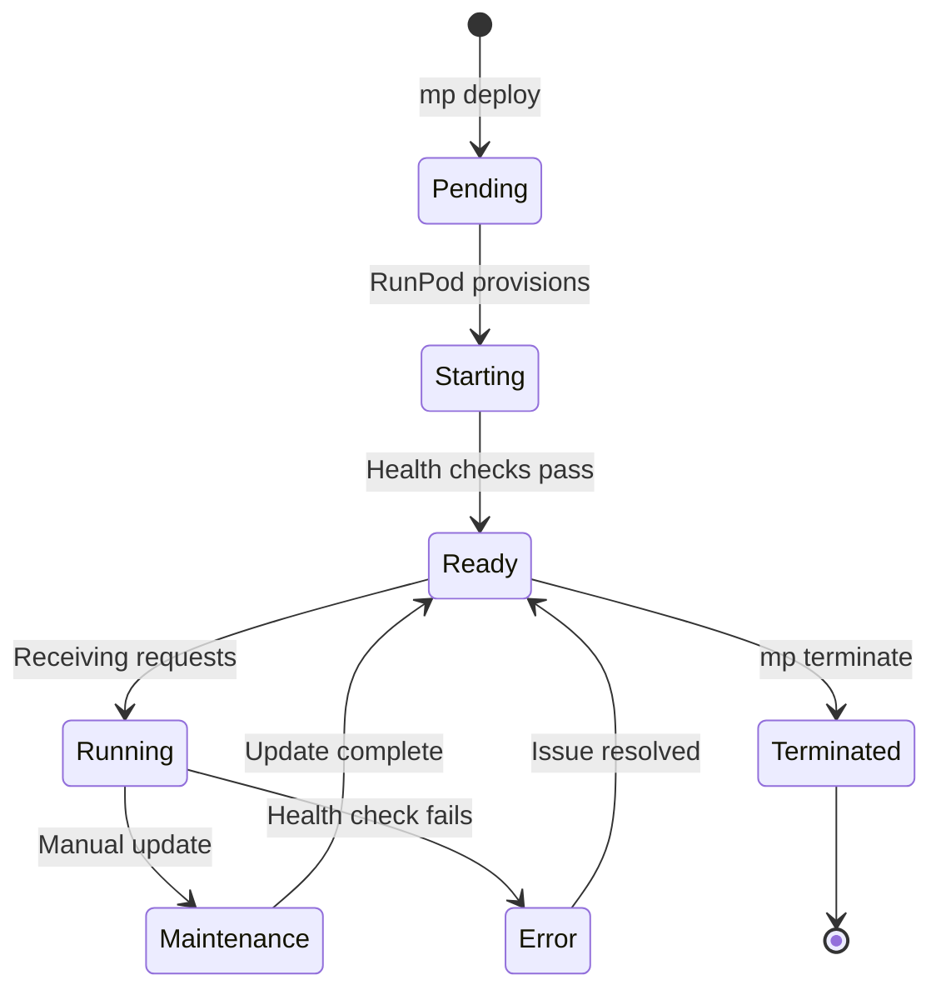

# 🚀 Deployment Guide

> **Deploy your ML models to RunPod and connect to live trading infrastructure**

## Deployment Overview

The marketplace supports deploying your trained models to RunPod for scalable inference. Models can be deployed from:

- ✅ **Templates**: Pre-built inference servers
- ✅ **Custom Docker Images**: Your own containerized models
- ✅ **Hugging Face Models**: Models trained via marketplace

## Quick Deployment

### **From Template (Recommended)**

```bash
# Create inference server from template
mp init --template runpod-signal-http
cd my-trading-model

# Install dependencies and test locally
npm install
mp dev
mp validate

# Deploy to RunPod
mp deploy --provider runpod --cpu 2 --memory 4

# Register in marketplace catalog
mp register --name "My Signal Model" --version 1.0.0

# Connect to live trading
mp link-infra
```

### **From Trained Model**

```bash
# After training completes
mp train status <run_id>
# → Status: succeeded

# Deploy the trained model
mp deploy --from-training <run_id> --provider runpod

# Automatic registration and linking
mp register --from-training <run_id>
mp link-infra
```

## Deployment Configuration

### **Resource Profiles**

| Profile | CPU | Memory | GPU | Use Case |
|---------|-----|--------|-----|----------|
| `micro` | 1 core | 2GB | None | Light testing |
| `small` | 2 cores | 4GB | None | Development |
| `medium` | 4 cores | 8GB | T4 | Production |
| `large` | 8 cores | 16GB | A100 | High-frequency |
| `xlarge` | 16 cores | 32GB | H100 | Complex models |

### **Custom Configuration**

```bash
# Specify exact resources
mp deploy --provider runpod \
  --cpu 4 \
  --memory 8 \
  --gpu T4 \
  --disk 20 \
  --region us-east

# With budget limits
mp deploy --provider runpod \
  --cpu 2 --memory 4 \
  --max-cost 50 \
  --max-hours 24
```

### **Environment Variables**

The CLI automatically sets these environment variables:

```bash
# Marketplace identification
VENDOR_ID=vendor_abc123
DEPLOYMENT_ID=dep_xyz789
MODEL_ID=your_model_name
MODEL_VERSION=1.0.0

# Infrastructure access
MARKETPLACE_TOKEN=sit_scoped_infra_token
INFRA_SIGNALS_URL=https://infra.neuronetiq.com/api/signals/store
MARKETPLACE_API_URL=https://infra.neuronetiq.com

# Monitoring
HEARTBEAT_INTERVAL=30
LOG_LEVEL=info
```

## RunPod Integration

### **Deployment Process**

1. **Image Preparation**: CLI builds and pushes Docker image
2. **Resource Allocation**: RunPod provisions compute resources
3. **Environment Setup**: CLI configures environment variables
4. **Health Checks**: Deployment validates `/health` and `/ready` endpoints
5. **Registration**: Model appears in marketplace catalog
6. **Monitoring**: Heartbeats begin automatically

### **RunPod Configuration**

```typescript
// Deployment specification sent to RunPod
{
  name: "vendor-model-signal-v1",
  image: "your-registry/signal-model:latest",
  gpu: "T4",
  cpu: 2,
  memory: 4096,
  containerDiskInGb: 20,
  env: [
    { key: "VENDOR_ID", value: "vendor_abc123" },
    { key: "DEPLOYMENT_ID", value: "dep_xyz789" },
    { key: "MARKETPLACE_TOKEN", value: "sit_..." }
  ],
  ports: [{ containerPort: 8080, type: "http" }]
}
```

### **Auto-scaling Configuration**

```bash
# Enable auto-scaling based on load
mp deploy --provider runpod \
  --autoscale \
  --min-instances 1 \
  --max-instances 10 \
  --scale-metric cpu \
  --scale-threshold 70
```

## Health & Monitoring

### **Required Endpoints**

Your deployed model must implement:

**Health Check:**
```http
GET /health
→ 200 OK
{
  "status": "ok",
  "version": "1.0.0",
  "timestamp": "2025-01-03T10:30:00Z",
  "deployment_id": "dep_xyz789"
}
```

**Readiness Check:**
```http
GET /ready  
→ 200 OK
{
  "status": "ready",
  "model_loaded": true,
  "startup_time_ms": 5000
}
```

**Inference Endpoint:**
```http
POST /infer
Content-Type: application/json

{
  "symbol": "EURUSD",
  "timeframe": "5m",
  "ohlcv": [[...]]
}

→ 200 OK
{
  "decision": "BUY",
  "confidence": 0.85,
  "model_version": "1.0.0",
  "timestamp": "2025-01-03T10:30:00Z"
}
```

### **Monitoring Dashboard**

View deployment status in vendor console:
- 🟢 **Online**: Healthy heartbeats within 60 seconds
- 🟡 **Degraded**: Slow responses or errors
- 🔴 **Offline**: No heartbeats for 5+ minutes
- ⚫ **Stopped**: Manually terminated

## Scaling & Performance

### **Horizontal Scaling**

```bash
# Scale up for high load
mp scale --deployment dep_xyz789 --instances 5

# Scale down to save costs
mp scale --deployment dep_xyz789 --instances 1

# Auto-scaling based on metrics
mp scale --deployment dep_xyz789 --auto \
  --min 1 --max 10 \
  --cpu-target 70 \
  --memory-target 80
```

### **Performance Optimization**

**Model Loading:**
```typescript
// Lazy load models to reduce startup time
let model = null;

app.post("/infer", async (req, reply) => {
  if (!model) {
    model = await loadModel(); // Load on first request
  }
  
  const prediction = await model.predict(req.body);
  return reply.send(prediction);
});
```

**Caching:**
```typescript
// Cache predictions for identical inputs
const predictionCache = new Map();

app.post("/infer", async (req, reply) => {
  const cacheKey = JSON.stringify(req.body);
  
  if (predictionCache.has(cacheKey)) {
    return reply.send(predictionCache.get(cacheKey));
  }
  
  const prediction = await runInference(req.body);
  predictionCache.set(cacheKey, prediction);
  
  return reply.send(prediction);
});
```

## Deployment Lifecycle

### **Deployment States**



### **State Transitions**

| From | To | Trigger | Action |
|------|-------|---------|--------|
| Pending | Starting | RunPod provisions | Wait for startup |
| Starting | Ready | Health checks pass | Begin serving |
| Ready | Running | First request | Normal operation |
| Running | Error | Health check fails | Alert vendor |
| Error | Ready | Issue resolved | Resume serving |
| Any | Terminated | `mp terminate` | Clean shutdown |

## Custom Docker Images

### **Docker Requirements**

```dockerfile
FROM node:20-alpine

# Install your model dependencies
COPY requirements.txt .
RUN pip install -r requirements.txt

# Copy model code
COPY src/ ./src/

# Required: Implement health and inference endpoints
EXPOSE 8080

# Required: Non-root user for security
USER node

# Required: Graceful shutdown handling
CMD ["node", "src/server.js"]
```

### **Endpoint Implementation**

```typescript
// Minimum required endpoints
app.get("/health", () => ({ status: "ok" }));
app.get("/ready", () => ({ status: "ready" }));
app.post("/infer", async (req) => {
  // Your inference logic
  return {
    decision: "BUY",
    confidence: 0.8,
    model_version: "1.0.0",
    timestamp: new Date().toISOString()
  };
});
```

### **Deploy Custom Image**

```bash
# Build and push to registry
docker build -t your-registry/model:v1 .
docker push your-registry/model:v1

# Deploy to RunPod
mp deploy --provider runpod \
  --image your-registry/model:v1 \
  --cpu 2 --memory 4
```

## Security & Compliance

### **Security Best Practices**

- ✅ **Non-root containers**: Use non-privileged users
- ✅ **Secret management**: Never bake tokens into images
- ✅ **Network security**: Only expose required ports
- ✅ **Input validation**: Validate all inference requests
- ✅ **Error handling**: Don't leak sensitive information

### **Compliance Requirements**

- ✅ **Data privacy**: Don't log sensitive trading data
- ✅ **Token security**: Use scoped Infrastructure tokens only
- ✅ **Audit logging**: Log all inference requests (without tokens)
- ✅ **Rate limiting**: Respect marketplace quotas
- ✅ **Health reporting**: Send accurate heartbeats

## Troubleshooting Deployments

### **Common Issues**

**Deployment Fails to Start:**
```bash
# Check RunPod status
mp deploy --provider runpod --status dep_xyz789

# View deployment logs
mp logs --deployment dep_xyz789

# Check resource limits
mp deploy --provider runpod --cpu 1 --memory 2  # Try smaller
```

**Health Checks Failing:**
```bash
# Test endpoints locally
mp validate --url http://localhost:8080

# Check endpoint implementation
curl http://your-deployment/health
curl http://your-deployment/ready
```

**Model Not Appearing in Catalog:**
```bash
# Check registration status
mp register --status --name "Your Model"

# Verify heartbeats
mp heartbeat --deployment-id dep_xyz789

# Check vendor console
# Visit: https://trader.neuronetiq.com/marketplace/vendor
```

**Performance Issues:**
```bash
# Monitor resource usage
mp metrics --deployment dep_xyz789

# Scale up resources
mp scale --deployment dep_xyz789 --cpu 4 --memory 8

# Check for memory leaks
mp logs --deployment dep_xyz789 --grep "memory"
```

### **Emergency Procedures**

**Deployment Unresponsive:**
```bash
# Force restart
mp restart --deployment dep_xyz789

# Emergency scale down
mp scale --deployment dep_xyz789 --instances 0

# Terminate if necessary
mp terminate --deployment dep_xyz789
```

**High Error Rate:**
```bash
# Check error logs
mp logs --deployment dep_xyz789 --level error

# Roll back to previous version
mp rollback --deployment dep_xyz789 --version 1.0.0

# Scale down to investigate
mp scale --deployment dep_xyz789 --instances 1
```

## Cost Management

### **Cost Estimation**

```bash
# Estimate deployment costs
mp deploy --provider runpod --cpu 2 --memory 4 --estimate-only
# → Estimated cost: $0.50/hour

# Set budget limits
mp deploy --provider runpod --cpu 2 --memory 4 \
  --max-cost 100 --max-hours 24
```

### **Cost Optimization**

- **Right-size resources**: Start small, scale based on load
- **Use spot instances**: 50-80% cost savings for non-critical workloads
- **Auto-scaling**: Scale to zero during low usage
- **Scheduled scaling**: Scale down during off-hours

**Ready to deploy your models? Start with the [quickstart guide](./quickstart.md)!** 🚀
